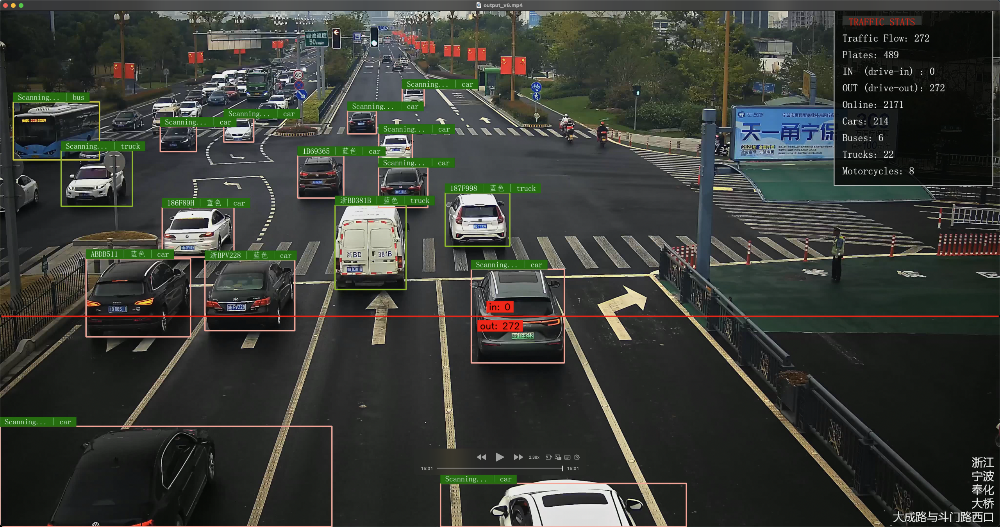
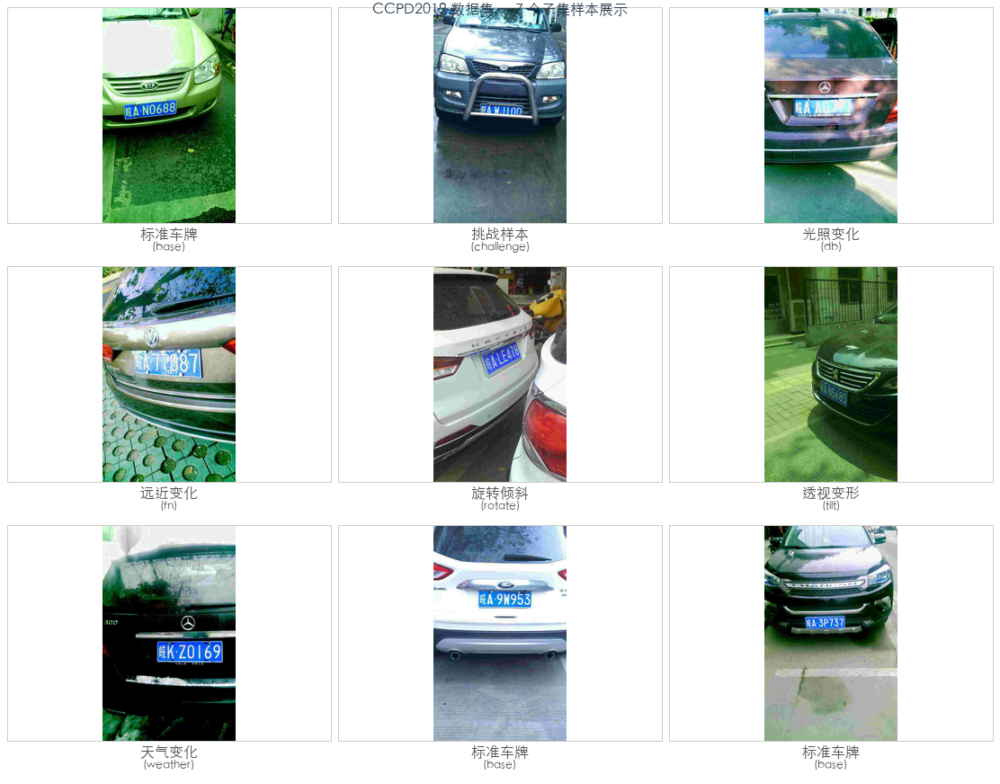
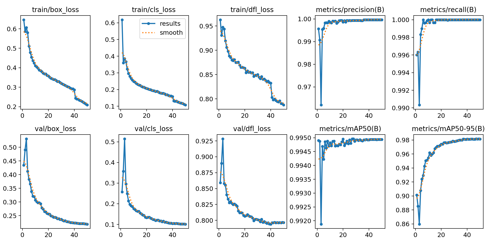
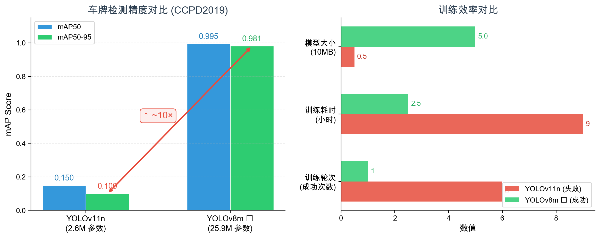

# 智能交通车牌识别系统

> 版本：v3.3 | 更新：2026-06-07 15:30 (北京时间) | 基于 YOLOv8m + PaddleOCR + supervision | 字体渲染修复版 + 实验报告&amp;答辩PPT完成

---

## 项目简介

基于深度学习的交通监控视频智能分析系统。输入 4K 交通监控视频，输出带标注的识别结果视频。

**支持**：
- 车辆检测与分类（car/bus/truck/motorcycle）
- 多目标车辆跟踪（ByteTrack）
- 车流量统计（正向/反向，即 IN/OUT）
- 车牌检测与定位
- 车牌字符识别（PaddleOCR PP-OCRv4）
- 车牌底色识别（蓝/绿/黄/其他）
- 中文标签渲染 + 统计面板叠加

**应用场景**：路口监控、停车场管理、智慧交通

---

## 项目功能

| 功能 | 实现方式 | 设备 | 指标 |
|------|---------|------|------|
| 车辆检测+分类 | YOLOv8m COCO 预训练 | GPU | 4 类：car/bus/truck/motorcycle |
| 车辆跟踪 | YOLO 内置 ByteTrack | GPU | persist=True |
| 车流量统计 | supervision LineZone 越线计数 | CPU | IN/OUT 方向约定 |
| 车牌检测 | YOLOv8m **自己训练** | GPU | mAP50=0.995, mAP50-95=0.981 |
| 车牌 OCR | PaddleOCR PP-OCRv4 | CPU | enhance()+clean_plate() |
| 车牌颜色 | HSV 纯规则 | CPU | 蓝/绿/黄/其他 四分类 |

---

## 技术架构

```
视频帧 (4096×2160, 12 FPS)
  │
  ├─→ YOLOv8m.track(classes=[car,bus,truck,motorcycle], half=True)     [GPU]
  │     │
  │     ├─→ supervision LineZone 越线计数              [CPU]
  │     │     ├─ IN  (驶近) = 越过线且向下运动
  │     │     └─ OUT (驶离) = 越过线且向上运动
  │     │
  │     └─→ 每辆车 crop
  │           │
  │           ├─ 跳过 vy2 < height*0.3 的远处车
  │           │
  │           └─→ YOLOv8m(plate, imgsz=480, half=True) [GPU]
  │                 │
  │                 ├─→ PaddleOCR PP-OCRv4             [CPU]
  │                 │     ├─ enhance(): 灰度→2x超分→对比度→高斯去噪
  │                 │     └─ clean_plate(): 正则过滤非车牌字符
  │                 │
  │                 └─→ HSV 颜色分类                    [CPU]
  │
  └─→ PIL 中文渲染 → MP4 输出
       ├─ 标签: "车牌号 | 颜色 | 车型" (48px)
       └─ 统计面板: Traffic Flow / Plates / IN / OUT / 分车型 (44px)
```

**技术栈**：Python 3.10 + YOLOv8m + PaddleOCR + OpenCV + supervision + PIL


---

## 效果预览

| 推理输出帧 1 | 推理输出帧 2 |
|:--:|:--:|
|  |  |

*4K 交通监控视频推理结果：检测框 + 车牌号 + 颜色 + 车型 + 统计面板 + 横截线*

---

## 项目结构

```
MachineVision_finalTest/
│
├── src/                                    # 核心推理代码
│   ├── infer.py                            #   主推理管线 (~310行)
│   ├── plate_ocr.py                        #   PaddleOCR 封装 (~80行)
│   └── plate_color.py                      #   HSV 颜色分类 (~55行)
│
├── scripts/                                # 数据预处理工具
│   ├── convert_ccpd.py                     #   CCPD2019 → YOLO 格式
│   ├── split_dataset.py                    #   训练/验证集划分
│   ├── generate_report.py                  #   实验报告 .docx 生成
│   └── generate_materials.py               #   素材图表生成
│
├── images/                                 # 项目素材
│
├── data.yaml                               # YOLO 训练配置
├── requirements.txt                        # Python 依赖（全版本锁定）
├── README.md                               # 项目说明书
│
├── dataset/                                # 训练数据
│   ├── images/train/                       #   训练集 17,000 张
│   └── images/val/                         #   验证集 3,000 张
│
├── runs/detect/train-9/                    # 训练产出
│   ├── weights/best.pt                     #   ★ 最终车牌检测模型 (mAP50-95=0.981)
│   └── results.png                         #   训练曲线
│
├── models/                                 # 模型权重
│   └── plate_best.pt                       #   部署用模型副本
│
└── results/                                # 推理输出
    └── output_v6.mp4                       #   最终标注视频
```

---

## 环境配置

### 1. 创建环境

```bash
conda create -n traffic python=3.10 -y
conda activate traffic
```

### 2. 安装依赖

```bash
pip install -r requirements.txt
# ⚠️ 后续任何 pip install 必须加 --no-deps，防止 numpy 被升级
```

### 3. 验证环境

```bash
python -c "import torch; print('CUDA:', torch.cuda.is_available())"
python -c "from paddleocr import PaddleOCR; print('PaddleOCR OK')"
python -c "import supervision; print('supervision OK')"
```

### 关键约束

| 约束 | 原因 |
|------|------|
| Python 3.10 only | PaddlePaddle 不支持 3.12+ |
| numpy==1.26.4 死锁 | Paddle/PaddleOCR 不兼容 numpy 2.x |
| PaddleOCR CPU only | GPU segfault (CUDA 12.8) |
| YOLOv8 不要升级到 YOLOv11 | v2.x 已验证 YOLOv11 训练告败 |

---

## 数据集准备

### 1. 下载 CCPD2019

从 [CCPD2019](https://github.com/detectRecog/CCPD) 下载后解压：

```bash
unzip CCPD2019.zip -d CCPD2019/
```

### 2. 转换 → YOLO 格式

```bash
# ~35 分钟，121,431 张
python scripts/convert_ccpd.py \
  --source CCPD2019/CCPD2019/ \
  --output dataset/ccpd_yolo
```

### 3. 划分训练/验证集

```bash
# 20k 采样，85/15 分割
python scripts/split_dataset.py \
  --source dataset/ccpd_yolo \
  --target dataset \
  --max_samples 20000
```

### 数据说明

| 项目 | 值 |
|------|-----|
| 来源 | CCPD2019（7 个子集：base/challenge/db/fn/rotate/tilt/weather） |
| 全量 | 121,431 张 |
| 训练集 | 17,000 张 |
| 验证集 | 3,000 张 |
| 标注格式 | YOLO .txt (class_id xc yc w h) |
| 类别 | 单类：plate (class_id=0) |



---

## 模型训练

### 车牌检测模型

```bash
# RTX 3090 24GB | 必须用 screen 包裹！
screen -S train
yolo detect train \
  data=data.yaml \
  model=yolov8m.pt \
  epochs=50 \
  batch=64 \
  imgsz=640 \
  device=0 \
  cache=ram \
  workers=4 \
  amp=True
# Ctrl+A+D 挂起
```

### 训练结果 (train-9)

| 指标 | 值 |
|------|-----|
| mAP50 | 0.995 |
| mAP50-95 | **0.981** |
| best.pt 大小 | 50 MB |
| 训练耗时 | ~2.5 小时 |
| 设备 | RTX 3090 24GB |

### vs 旧版 (v2.x yolo11n)

| 指标 | v2.x (train-6) | v3.0 (train-9) |
|------|:---:|:---:|
| 基础模型 | yolo11n (2.6M) | yolov8m (25.9M) |
| mAP50-95 | 0.10 | **0.981** |
| 提升 | - | **~10x** |





### 关键教训
- **不要用 nano 模型**：2.6M 参数无法学习车牌小目标
- **batch 不要超 64**：128 OOM，64 稳定
- **cache=ram 时 workers ≤ 4**：不然 DataLoader 崩溃
- **50 epoch 足够**：不需要 100

---

## 模型推理

### 基础用法

```bash
python src/infer.py \
  --video traffic.mp4 \
  --vehicle-model yolov8m.pt \
  --plate-model runs/detect/train-9/weights/best.pt \
  --device cuda --no-gpu-ocr
```

### 推荐用法（优化版）

```bash
python src/infer.py \
  --video traffic.mp4 \
  --vehicle-model yolov8m.pt \
  --plate-model runs/detect/train-9/weights/best.pt \
  --device cuda \
  --no-gpu-ocr \
  --half \
  --plate-imgsz 480 \
  --output results/output_v3.mp4
```

### 参数说明

| 参数 | 默认值 | 说明 |
|------|--------|------|
| `--video` | traffic.mp4 | 输入视频路径 |
| `--vehicle-model` | yolov8m.pt | 车辆检测模型 |
| `--plate-model` | models/plate_best.pt | 车牌检测模型 |
| `--device` | cuda | 推理设备 (cuda/cpu) |
| `--no-gpu-ocr` | False | **必须开启**，否则 segfault |
| `--half` | False | FP16 半精度，速度翻倍 |
| `--plate-imgsz` | 480 | 车牌检测输入尺寸，480 比 640 快 1.8x |
| `--conf` | 0.25 | 车辆检测置信度 |
| `--plate-conf` | 0.25 | 车牌检测置信度 |
| `--line-y` | 0 | 横截线位置 (0=自动 60%) |
| `--retry` | 10 | OCR 重试间隔(帧) |
| `--output` | results/output.mp4 | 输出视频路径 |

### 终端进度条

| 字段 | 含义 | 类型 |
|------|------|------|
| `[749/10813]` | 已处理帧 / 总帧数 | 进度 |
| `online:15` | 当前帧画面中正在跟踪的车辆数 | 瞬时 |
| `plates:20` | 累计已识别车牌的唯一车辆数 | 累计 |
| `IN:6` | 累计驶离车辆数 | 累计 |
| `OUT:0` | 累计驶近车辆数 | 累计 |

---

## 配置说明

### data.yaml

```yaml
path: dataset
train: images/train
val: images/val
names:
  0: plate
```

### requirements.txt 关键依赖

```
numpy==1.26.4          # ⚠️ 死锁，禁止升级
ultralytics>=8.2.0,<8.4.0
paddleocr==2.7.3
paddlepaddle==2.6.0
opencv-python==4.8.1.78
supervision>=0.22.0,<0.24.0
```

### 方向约定

```
IN  = 驶近 (车头朝摄像机，画面中向下运动)
OUT = 驶离 (车尾朝摄像机，画面中向上运动)
车流量 = IN + OUT
```

---

## 结果展示

### 输入

- 4K 交通监控视频（高位俯拍，单向车流）
- 分辨率：4096×2160, 12 FPS, 15 分钟

### 输出

- 标注视频，每辆车上方显示：`车牌号 | 颜色 | 车型`
- 右上角统计面板：
  - Traffic Flow（总车流量）
  - Plates（已识别车牌数）
  - IN / OUT 分别统计
  - Cars / Buses / Trucks / Motorcycles 分车型统计
- 红色横截线标记越线检测位置

### 推理性能

| 模式 | 速度 | 说明 |
|------|------|------|
| FP32 | ~1x | 基准 |
| FP16 (`--half`) | ~2x | 推荐，精度无损 |
| FP16 + imgsz=480 | ~3.6x | 推荐组合 |

### 模型精度

| 模型 | mAP50 | mAP50-95 | 说明 |
|------|-------|----------|------|
| v2.x yolo11n | 0.995 | 0.10 | 报废，mAP50 虚高 |
| v3.0 yolov8m | 0.995 | **0.981** | 生产可用 |

---

## 常见问题

### Q: CUDA 不可用？
```bash
python -c "import torch; print(torch.cuda.is_available())"
# 如果 False，检查 PyTorch 是否带 CUDA
pip install torch --index-url https://download.pytorch.org/whl/cu128 --no-deps
```

### Q: PaddleOCR segfault？
必须加 `--no-gpu-ocr`。CUDA 12.8 与 PaddlePaddle 2.6.2 GPU 模式不兼容，CPU 推理速度足够快。

### Q: 推理时 numpy 报错？
numpy 被升级到 2.x。执行：
```bash
pip install "numpy==1.26.4" --force-reinstall --no-deps
```

### Q: 训练 DataLoader 崩溃？
workers 太多。cache=ram 时 workers 不要超过 4。

### Q: 训练 OOM？
batch 太大。RTX 3090 24GB 跑 yolov8m 最大 batch=64。

### Q: 车牌识别全是 Unknown？
检查 PaddleOCR 是否正常初始化，检查车牌 crop 是否为空图片。

### Q: 汉字显示 ????
字体文件找不到，自动回退默认字体。检查 `/usr/share/fonts/` 下是否有 NotoSansCJK。

---

## 开发路线图

### 当前版本：v3.3

**已完成**：
- ✅ YOLOv8m 车辆检测 + ByteTrack 跟踪
- ✅ YOLOv8m 车牌检测（自训练 CCPD2019, mAP50-95=0.981）
- ✅ PaddleOCR PP-OCRv4 车牌文字识别
- ✅ HSV 车牌颜色分类（蓝/绿/黄/其他）
- ✅ supervision LineZone 车流量统计（IN/OUT）
- ✅ FP16 半精度推理优化
- ✅ PIL 中文标签渲染 + 统计面板（v5/v6 字体修复版）
- ✅ .memory 长期记忆系统搭建
- ✅ 实验报告 .docx（用户已完成撰写和校对）
- ✅ 答辩 PPT 大纲（v3.2, 19 Slider + Prompt + Q&A）
- ✅ 全部素材（images/ 目录 20 个文件，11 类素材）

**进行中**：
- 🔜 答辩 PPT 制作

**计划中**：
- ⬜ 推理结果抽查验证
- ⬜ [可选] PaddleOCR 车牌微调
- ⬜ [可选] 多视频批量推理支持

---

## 相关文档

| 文件 | 用途 |
|------|------|
| [README.md](README.md) | 项目说明书 |
| [requirements.txt](requirements.txt) | Python 依赖清单 |
| [data.yaml](data.yaml) | YOLO 训练配置 |
